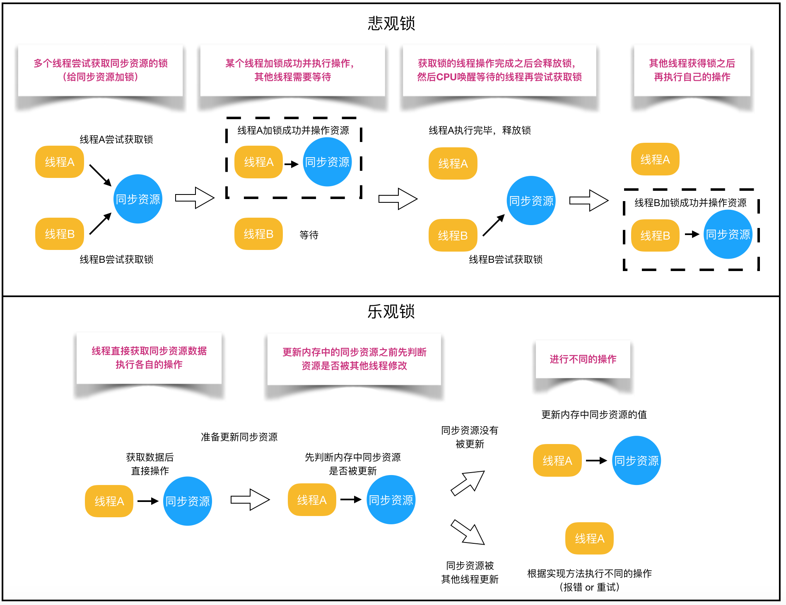

# Java高频面试题

## Java基础

### 谈谈你对Java平台的理解？

Java 本身是一种面向对象的语言，最显著的特性有两个方面，一是所谓的“书写一次，到处运行”（Write once, run anywhere），能够非常容易地获得跨平台能力；另外就是垃圾收集（GC, Garbage Collection），Java 通过垃圾收集器（Garbage Collector）回收分配内存，大部分情况下，程序员不需要自己操心内存的分配和回收

JRE（Java Runtime Environment）或者 JDK（Java Development Kit）。 JRE，也就是 Java 运行环境，包含了 JVM 和 Java 类库，以及一些模块等。而 JDK 可以看作是 JRE 的一个超集，提供了更多工具，比如编译器、各种诊断工具等

### Java是解释执行，这句话正确吗

对于“Java 是解释执行”这句话，这个说法不太准确。通常把java分为编译期和运行时，我们开发的 Java 的源代码，首先通过 Javac 编译成为字节码（bytecode，class文件），然后，在运行时，通过 Java 虚拟机（JVM）内嵌的解释器将字节码转换成为最终的机器码

常见的编译型语言如C++，通常会把代码直接编译成CPU所能理解的机器码来运行，所以在性能上，Java通常不如C++这类编译型语言

但是常见的 JVM，比如我们大多数情况使用的 Oracle JDK 提供的 Hotspot JVM，有两种字节码翻译成机器码的形式，第一种是解释执行，即逐条将字条码翻译成机器码并执行，第二种是即时编译（JIT编译），即将一个方法中包含的所有字节码编译成机器码后再执行，JIT 能够在运行时将热点代码的字节码编译成机器码，这种情况下部分热点代码就属于编译执行，而不是解释执行了

解释执行的优势是无需等待编译，对于占据大部分的不常用代码，无需耗费时间将其编译成机器码，而是采取解释执行的方式执行。编译执行的优势是实际运行速度更快，以方法为单位进行即时编译，对于仅占据小部分的热点代码，可以将其编译成机器码，以达到理想的速度

在运行时，JVM会通过类加载器加载字节码，在这个过程中会进行词法分析、语法分析、语义分析，编译原理中这部分的编译称为前端编译。接下来无需编译直接逐条将字节码解释执行，在解释执行的过程中，虚拟机同时对程序运行的信息进行收集，在这些信息的基础上，编译器会逐渐发挥作用，它会进行后端编译——把字节码编译成机器码，但不是所有的代码都会被编译，只有被JVM认定为的热点代码，才可能被编译。JVM中会设置一个阈值，当方法或者代码块的在一定时间内的调用次数超过这个阈值时就会被编译，存入codeCache中。当下次执行时，再遇到这段代码，就会从codeCache中读取机器码，直接执行，以此来提升程序运行的性能

JVM中集成了两种即时编译器，Client Compiler（C1）和Server Compiler（C2），它们的作用也不同，之所以引入多个即时编译器，是为了在编译时间和生成代码的执行效率之间进行取舍。Client Compiler注重启动速度和局部的优化，Server Compiler则更加关注全局的优化，性能会更好，但由于会进行更多的全局分析，所以启动速度会变慢。两种编译器有着不同的应用场景，在虚拟机中同时发挥作用

字节码的解释执行和即时编译可同时进行，编译完成后的机器码会在下次调用该方法时启用，以替换原本的解释执行

### final、finalize 和 finally 的不同之处

- final 是一个修饰符，可以修饰变量、方法和类。final 修饰变量，意味着该变量的值在初始化后不能被改变，final修饰的class不可以继承扩展、final修饰的方法不可以重写

  但是final不等同immutable，只能约束对象的引用不可以被改写，但是实际对象是可变的

- finally 是一个关键字，与 try 和 catch 一起用于异常的处理。finally 块一定会被执行，无论在 try 块中是否有发生异常，可以用try-finally或者try-catch-finally来进行关闭jdbc连接、包括unlock锁等动作

- finalize是基础类java.lang.Object的一个方法，Java 技术允许使用 finalize() 方法在垃圾收集器将对象从内存中清除出去之前做必要的清理工作。这个方法是由垃圾收集器在确定这个对象没有被引用时对这个对象调用的，但是什么时候调用 finalize 没有保证，所以现在不推荐使用了

## Java异常

### Exception和Error有什么区别

Exception 和 Error 都是继承了 Throwable 类，在 Java 中只有 Throwable 类型的实例才可以被抛出（throw）或者捕获（catch），它是异常处理机制的基本组成类型。 Exception 和 Error 体现了 Java 平台设计者对不同异常情况的分类。

Exception 是程序正常运行中，可以预料的意外情况，可能并且应该被捕获，进行相应处理。 

Error 是指在正常情况下，不大可能出现的情况，绝大部分的 Error 都会导致程序（比如 JVM 自身）处于非正常的、不可恢复状态。既然是非正常情况，所以不便于也不需要捕获，常见的比如 OutOfMemoryError 之类，都是 Error 的子类。

Exception 又分为可检查（checked）异常和不检查（unchecked）异常

可检查异常在源代码里必须显式地进行捕获处理，这是编译期检查的一部分。前面我介绍的不可查的 Error，是 Throwable 不是 Exception。 

不检查异常就是所谓的运行时异常，类似 NullPointerException、ArrayIndexOutOfBoundsException 之类，通常是可以编码避免的逻辑错误，具体根据需要来判断是否需要捕获，并不会在编译期强制要求

### Throwable、Exception、Error的设计和分类

**Throwable** 是 Java 语言中所有错误与异常的超类

- **Error** 类及其子类：程序中无法处理的错误，表示运行应用程序中出现了严重的错误。

- **Exception** 程序本身可以捕获并且可以处理的异常。Exception 这种异常又分为两类：运行时异常和编译时异常。

- 运行时异常

都是RuntimeException类及其子类异常，如NullPointerException(空指针异常)、IndexOutOfBoundsException(下标越界异常)等，这些异常是不检查异常，程序中可以选择捕获处理，也可以不处理。这些异常一般是由程序逻辑错误引起的，程序应该从逻辑角度尽可能避免这类异常的发生。

运行时异常的特点是Java编译器不会检查它，也就是说，当程序中可能出现这类异常，即使没有用try-catch语句捕获它，也没有用throws子句声明抛出它，也会编译通过。

- 非运行时异常（编译异常）

是RuntimeException以外的异常，类型上都属于Exception类及其子类。从程序语法角度讲是必须进行处理的异常，如果不处理，程序就不能编译通过。如IOException、SQLException等以及用户自定义的Exception异常，一般情况下不自定义检查异常。


### throw和throws的区别

- 异常的申明(throws)

  在Java中，当前执行的语句必属于某个方法，Java解释器调用main方法执行开始执行程序。若方法中存在检查异常，如果不对其捕获，那必须在方法头中显式声明该异常，以便于告知方法调用者此方法有异常，需要进行处理。 在方法中声明一个异常，方法头中使用关键字throws，后面接上要声明的异常。若声明多个异常，则使用逗号分割

- 异常的抛出(throw)

  throw关键字通常用在方法体中，并且抛出一个异常对象。程序在执行到throw语句时立即停止，它后面的语句都不执行。通过throw抛出异常后，如果想在上一级代码中来捕获并处理异常，则需要在抛出异常的方法中使用throws关键字在方法声明中指明要跑出的异常；如果要捕捉throw抛出的异常，则必须使用try—catch语句

### NoClassDefFoundError和ClassNotFoundException的区别

NoClassDefFoundError是**一个错误(Error)**，而 ClassNotFoundException 是**一个异常**。

- NoClassDefFoundError

  如果在编译时候正常，但在运行时执行new关键词的时候，发现依赖类找不到，或者是对于初始化失败的一个类，再次访问其静态成员或者方法，那么会直接抛出NoClassDefFoundError错误

  侧重在使用阶段时却出现了问题比如实例化依赖类找不到或者类本身就初始化失败了

- ClassNotFoundException

  直接采用反射或者类加载器的loadClass方法去动态加载一个所有classpath里面的都不存在的类，类加载器在运行时的load阶段就会直接抛出ClassNotFoundException异常

  侧重在类加载器加载阶段找不到类信息

## JVM和性能调优

### 说说强引用、软引用、弱引用、幻象引用

不同的引用类型，主要体现的是对象不同的可达性（reachable）状态和对垃圾收集的影响 。

- 强引用（Strong Reference）

  就是我们最常见的普通对象引用，只要还有强引用指向一个对象，就能表明对象还“活着”，垃圾收集器不会碰这种对象。对于一个普通的对象，如果没有其他的引用关系，只要超过了引用的作用域或者显式地将相应（强）引用赋值为null，就是可以被垃圾收集的了，当然具体回收时机还是要看垃圾收集策略

- 软引用（SoftReference）

  是一种相对强引用弱化一些的引用，可以让对象豁免一些垃圾收集，只有当JVM认为内存不足时，才会去试图回收软引用指向的对象。JVM会确保在抛出OutOfMemoryError之前，清理软引用指向的对象。软引用通常用来实现内存敏感的缓存，如果还有空闲内存，就可以暂时保留缓存，当内存不足时清理掉，这样就保证了使用缓存的同时，不会耗尽内存

- 弱引用（WeakReference）

  并不能使对象豁免垃圾收集，仅仅是提供一种访问在弱引用状态下对象的途径。这就可以用来构建一种没有特定约束的关系，比如，维护一种非强制性的映射关系，如果试图获取时对象还在，就使用它，否则重现实例化。它同样是很多缓存实现的选择

- 幻象引用（PhantomReference）

  有时候也翻译成虚引用，你不能通过它访问对象。幻象引用仅仅是提供了一种确保对象被fnalize以后，做某些事情的机制，比如，通常用来做所谓的PostMortem清理机制，Java平台自身Cleaner机制等，也有人利用幻象引用监控对象的创建和销毁

### 对象可达性状态流转分析

这是Java定义的不同可达性级别（reachability level），具体如下：

- 强可达（Strongly Reachable），就是当一个对象可以有一个或多个线程可以不通过各种引用访问到的情况。比如，我们新创建一个对象，那么创建它的线程对它就是强可达。
- 软可达（Softly Reachable），就是当我们只能通过软引用才能访问到对象的状态。
- 弱可达（Weakly Reachable），类似前面提到的，就是无法通过强引用或者软引用访问，只能通过弱引用访问时的状态。这是十分临近finalize状态的时机，当弱引用被清除的时候，就符合finalize的条件了。
- 幻象可达（Phantom Reachable），没有强、软、弱引用关联，并且finalize过了，只有幻象引用指向这个对象的时候。
- 当然，还有一个最后的状态，就是不可达（unreachable），意味着对象可以被清除了。

# Java并发

## 并发基础

### 并发三要素：可见性、原子性、有序性

并发出现问题的根源就是这三要素

众所周知，CPU、内存、I/O 设备的速度是有极大差异的，为了合理利用 CPU 的高性能，平衡这三者的速度差异，计算机体系结构、操作系统、编译程序都做出了贡献，主要体现为:

- CPU 增加了缓存，以均衡与内存的速度差异；// 导致 `可见性`问题
- 操作系统增加了进程、线程，以分时复用 CPU，进而均衡 CPU 与 I/O 设备的速度差异；// 导致 `原子性`问题
- 编译程序优化指令执行次序，使得缓存能够得到更加合理地利用。// 导致 `有序性`问题

**1. 可见性**

多核时代，每颗 CPU 都有自己的缓存，这时 CPU 缓存与内存的数据一致性就没那么容易解决了，当多个线程在不同的 CPU 上执行时，这些线程操作的是不同的 CPU 缓存。

普通的共享变量不能保证可见性，因为普通共享变量被修改之后，什么时候被写入主存是不确定的，当其他线程去读取时，此时内存中可能还是原来的旧值，因此无法保证可见性。

***如何解决？***

按需禁用缓存

Java提供了volatile关键字来保证可见性。当一个共享变量被volatile修饰时，它会保证修改的值会立即被更新到主存，当有其他线程需要读取时，它会去内存中读取新值。

另外，通过synchronized和Lock也能够保证可见性，synchronized和Lock能保证同一时刻只有一个线程获取锁然后执行同步代码，并且在释放锁之前会将对变量的修改刷新到主存当中。因此可以保证可见性。

**2. 原子性**

Java 并发程序都是基于多线程的，自然也会涉及到任务切换。任务切换的时机大多数是在时间片结束的时候，我们现在基本都使用高级语言编程，高级语言里一条语句往往需要多条 CPU 指令完成。我们把一个或者多个操作在 CPU 执行的过程中不被中断的特性称为原子性。CPU 能保证的原子操作是 CPU 指令级别的，而不是高级语言的操作符，这是违背我们直觉的地方。因此，很多时候我们需要在高级语言层面保证操作的原子性

***如何解决？***

Java内存模型只保证了基本读取和赋值是原子性操作，如果要实现更大范围操作的原子性，可以通过synchronized和Lock来实现。由于synchronized和Lock能够保证任一时刻只有一个线程执行该代码块，那么自然就不存在原子性问题了，从而保证了原子性。

**3. 有序性**

有序性指的是程序按照代码的先后顺序执行。编译器为了优化性能，有时候会改变程序中语句的先后顺序

在执行程序时为了提高性能，编译器和处理器常常会对指令做重排序。重排序分三种类型：

- 编译器优化的重排序。编译器在不改变单线程程序语义的前提下，可以重新安排语句的执行顺序。属于编译器重排序
- 指令级并行的重排序。现代处理器采用了指令级并行技术（Instruction-Level Parallelism， ILP）来将多条指令重叠执行。如果不存在数据依赖性，处理器可以改变语句对应机器指令的执行顺序。属于处理器重排序
- 内存系统的重排序。由于处理器使用缓存和读 / 写缓冲区，这使得加载和存储操作看上去可能是在乱序执行。属于处理器重排序

***如何解决？***

对于编译器，JMM 的编译器重排序规则会禁止特定类型的编译器重排序（不是所有的编译器重排序都要禁止）。对于处理器重排序，JMM 的处理器重排序规则会要求 java 编译器在生成指令序列时，插入特定类型的内存屏障（memory barriers，intel 称之为 memory fence）指令，通过内存屏障指令来禁止特定类型的处理器重排序（不是所有的处理器重排序都要禁止）

在Java里面，可以通过volatile关键字来保证一定的“有序性”。另外可以通过synchronized和Lock来保证有序性，很显然，synchronized和Lock保证每个时刻是有一个线程执行同步代码，相当于是让线程顺序执行同步代码，自然就保证了有序性。当然JMM是通过Happens-Before 规则来保证有序性的。

### Happens-Before 规则（解决可见性、有序性）

Java的内存模型是并发编程领域的一次重要创新，Java内存模型里面，最晦涩的部分就是Happens-Before规则

Happens-Before 的含义是：前面一个操作的结果对后续操作是可见的。Happens-Before 约束了编译器的优化行为，虽允许编译器优化，但是要求编译器优化后一定遵守 Happens-Before 规则。

Happens-Before的语义是一种因果关系。在现实世界里，如果A事件是导致B事件的起因，那么A事件一定是先于(Happens-Before)B事件发生的，这个就是Happens-Before语义的现实理解。

在Java语言里面，Happens-Before的语义本质上是一种可见性，A Happens-Before B 意味着A事件对B事件来说是可见的，无论A事件和B事件是否发生在同一个线程里。例如A事件发生在线程1上，B事件发生在线程2上，Happens-Before规则保证线程2上也能看到A事件的发生。

1. **程序的顺序性规则（单一线程原则）**

   这条规则是指在一个线程中，按照程序顺序，前面的操作 Happens-Before 于后续的任意操作

2. **volatile 变量规则**

   这条规则是指对一个volatile变量的写操作， Happens-Before 于后续对这个volatile变量的读操作

   对一个volatile变量的写操作相对于后续对这个volatile变量的读操作可见

3. **传递性**

   这条规则是指如果A Happens-Before B，且B Happens-Before C，那么A Happens-Before C

4. **管程中锁的规则**

   这条规则是指对一个锁的解锁 Happens-Before 于后续对这个锁的加锁。

   管程是一种通用的同步原语，在Java中指的就是synchronized，synchronized是Java里对管程的实现。

   管程中的锁在Java里是隐式实现的，在进入同步块之前，会自动加锁，而在代码块执行完会自动释放锁，加锁以及释放锁都是编译器帮我们实现的。

5. **线程 start() 规则**

   主线程A启动子线程B后，子线程B能够看到主线程在启动子线程B前的操作

   如果线程A调用线程B的 start() 方法(即在线程A中启动线程B)，那么该start()操作 Happens-Before 于线程B中的任意操作

6. **线程 join() 规则**

   主线程A等待子线程B完成(主线程A通过调用子线程B的join()方法实现)，当子线程B完成后(主线程A中join()方法返回)，主线程能够看到子线程的操作。当然所谓的“看到”，指的是对共享变量的操作。

   换句话说就是，如果在线程A中，调用线程B的 join() 并成功返回，那么线程B中的任意操作Happens-Before 于该 join() 操作的返回

### 如何实现线程安全

1. **互斥同步**

   synchronized 和 ReentrantLock

2. **非阻塞同步（无锁）**

   互斥同步最主要的问题就是线程阻塞和唤醒所带来的性能问题，因此这种同步也称为阻塞同步

   互斥同步属于一种悲观的并发策略，总是认为只要不去做正确的同步措施，那就肯定会出现问题。无论共享数据是否真的会出现竞争，它都要进行加锁

   - CAS (Compare And Swap)

     随着硬件指令集的发展，我们可以使用基于冲突检测的乐观并发策略: 先进行操作，如果没有其它线程争用共享数据，那操作就成功了，否则采取补偿措施(不断地重试，直到成功为止)。这种乐观的并发策略的许多实现都不需要将线程阻塞，因此这种同步操作称为非阻塞同步。

     乐观锁需要操作和冲突检测这两个步骤具备原子性，这里就不能再使用互斥同步来保证了，只能靠硬件来完成。硬件支持的原子性操作最典型的是: 比较并交换(Compare-and-Swap，CAS)。CAS 指令需要有 3 个操作数，分别是内存地址 V、旧的预期值 A 和新值 B。当执行操作时，只有当 V 的值等于 A，才将 V 的值更新为 B

     CPU 的 CAS 指令本身是能够保证原子性的，在 CAS 方案中，有一个问题可能会常被你忽略，那就是 ABA 的问题。对于 ABA 问题，通常的处理措施是对每一次 CAS 操作设置版本号。java.util.concurrent.atomic 包下提供了一个可处理 ABA 问题的原子类 AtomicStampedReference，只有保证版本号是递增的，即使A变成B之后再变回A，版本号也不会变回来

     CAS还有一个缺点，前面说到他的原理是通过自旋。自旋这个操作就是循环无限，直到CAS成功。所以这个自旋操作非常消耗CPU。可能会造成CPU飙升100%的情况，其他线程甚至抢不到CPU资源。所以原子类适合读多写少的场景

   - 原子类

     Java SDK 并发包将这种无锁方案封装提炼之后，实现了`一系列的原子类`。J.U.C 包里面的整数原子类 AtomicInteger，其中的 compareAndSet() 和 getAndIncrement() 等方法都使用了 Unsafe 类的 CAS 操作

     原子类内容很丰富，我们可以将它们分为五个类别：

     原子化的基本数据类型、原子化的对象引类型、原子化数组、原子化对象属性更新器、原子化的累加器

     Java提供的原子类能够解决一些简单的原子性问题，但都是针对一个共享变量的，如果要解决多个变量的原子性，还是用互斥锁来同步

3. **无需同步**

   要保证线程安全，并不是一定就要进行同步。如果一个方法本来就不涉及共享数据，那它自然就无须任何同步措施去保证正确性

   - **栈封闭**

     多个线程访问同一个方法的局部变量时，不会出现线程安全问题，因为局部变量存储在虚拟机栈中，属于线程私有的

   - **Thread Local**

     如果一段代码中所需要的数据必须与其他代码共享，那就看看这些共享数据的代码是否能保证在同一个线程中执行。如果能保证，我们就可以把共享数据的可见范围限制在同一个线程之内，这样，无须同步也能保证线程之间不出现数据争用的问题

   - **可重入代码**

     这种代码也叫做纯代码(Pure Code)，可以在代码执行的任何时刻中断它，转而去执行另外一段代码(包括递归调用它本身)，而在控制权返回后，原来的程序不会出现任何错误。

     可重入代码有一些共同的特征，例如不依赖存储在堆上的数据和公用的系统资源、用到的状态量都由参数中传入、不调用非可重入的方法等

## 线程基础

### Java线程的生命周期

Java语言中线程共有六种状态，分别是：

1. NEW（初始化状态）

   创建后尚未启动

2. RUNNABLE（可运行/运行状态）

   可能正在运行，也可能正在等待 CPU 时间片，包含了操作系统线程状态中的 Running 和 Ready

3. BLOCKED（阻塞状态）

   等待获取一个排它锁，如果其线程释放了锁就会结束此状态

4. WAITING（无时限等待）

   等待其它线程显式地唤醒，否则不会被分配 CPU 时间片

5. TIMED_WAITING（有时限等待）

   无需等待其它线程显式地唤醒，在一定时间之后会被系统自动唤醒

6. TERMINATED（终止状态）

   可以是线程结束任务之后自己结束，或者产生了异常而结束


BLOCKED、WAITING、TIMED_WAITING可以理解为线程导致休眠状态的三种原因，只要Java线程处于这三种状态之一，那么这个线程就永远没有CPU的使用权

- **从NEW到RUNNABLE状态**

  Java刚创建出来的Thread对象就是NEW状态

  NEW状态的线程，不会被操作系统调度，因此不会执行。Java线程要执行，就必须转换到RUNNABLE状态。从NEW状态转换到RUNNABLE状态很简单，只要调用线程对象的start()方法就可以了

- **RUNNABLE与BLOCKED的状态转换**

  只有一种场景会触发这种转换，就是线程等待synchronized的隐式锁。synchronized修饰的方法、代码块同一时刻只允许一个线程执行，其他线程只能等待，这种情况下，等待的线程就会从RUNNABLE转换到BLOCKED状态。而当等待的线程获得synchronized隐式锁时，就又会从BLOCKED转换到RUNNABLE状态

- **RUNNABLE与WAITING的状态转换**

  - 获得synchronized隐式锁的线程，调用无参数的Object.wait()方法
  - 调用无参数的Thread.join()方法。其中的join()是一种线程同步方法，例如有一个线程对象thread A，当调用A.join()的时候，执行这条语句的线程会等待thread A执行完，而等待中的这个线程，其状态会从RUNNABLE转换到WAITING。当线程thread A执行完，原来等待它的线程又会从WAITING状态转换到RUNNABLE
  - 调用LockSupport.park()方法。Java并发包中的锁，都是基于LockSupport对象实现的。调用LockSupport.park()方法，当前线程会阻塞，线程的状态会从RUNNABLE转换到WAITING。调用LockSupport.unpark(Thread thread)可唤醒目标线程，目标线程的状态又会从WAITING状态转换到RUNNABLE

  | 进入方法                                   | 退出方法                             |
  | ------------------------------------------ | ------------------------------------ |
  | 没有设置 Timeout 参数的 Object.wait() 方法 | Object.notify() / Object.notifyAll() |
  | 没有设置 Timeout 参数的 Thread.join() 方法 | 被调用的线程执行完毕                 |
  | LockSupport.park() 方法                    | -                                    |

- **RUNNABLE与TIMED_WAITING的状态转换**

  - 调用带超时参数的Thread.sleep(long millis)方法
  - 获得synchronized隐式锁的线程，调用带超时参数的Object.wait(long timeout)方法
  - 调用带超时参数的Thread.join(long millis)方法
  - 调用带超时参数的LockSupport.parkNanos(Object blocker, long deadline)方法
  - 调用带超时参数的LockSupport.parkUntil(long deadline)方法

  | 进入方法                                 | 退出方法                                        |
  | ---------------------------------------- | ----------------------------------------------- |
  | Thread.sleep() 方法                      | 时间结束                                        |
  | 设置了 Timeout 参数的 Object.wait() 方法 | 时间结束 / Object.notify() / Object.notifyAll() |
  | 设置了 Timeout 参数的 Thread.join() 方法 | 时间结束 / 被调用的线程执行完毕                 |
  | LockSupport.parkNanos() 方法             | -                                               |
  | LockSupport.parkUntil() 方法             | -                                               |

- **RUNNABLE到TERMINATED状态**

  - 线程执行完 run() 方法后，会自动转换到TERMINATED状态

  - 执行run()方法的时候异常抛出，也会导致线程终止

  - 强制中断run()方法的执行，调用stop()或interrupt()来终止

    - stop()和interrupt()方法的主要区别

      1. stop()方法会真的杀死线程，不给线程喘息的机会，如果线程持有ReentrantLock锁，被stop()的线程并不会自动调用ReentrantLock的unlock()去释放锁

      2. interrupt()方法就温柔多了，interrupt()方法仅仅是通知线程，线程有机会执行一些后续操作，同时也可以无视这个通知

         被interrupt的线程可以通过抛异常InterruptedException或主动检测来收到通知

### 线程使用方式

实现 Runnable 和 Callable 接口的类只能当做一个可以在线程中运行的任务，不是真正意义上的线程，因此最后还需要通过 Thread 来调用。可以说任务是通过线程驱动从而执行的

1. 实现 Runnable 接口

   需要实现 run() 方法，并将该实现类的实例对象作为创建Thread对象的参数，通过 Thread 调用 start() 方法来启动线程

2. 实现 Callable 接口

   实现 call() 方法，通过 Thread 调用 start() 方法来启动线程。与 Runnable 相比，Callable 可以有返回值，返回值通过 FutureTask 进行封装

3. 继承 Thread 类，重写run()方法

**实现接口更好的原因**

- Java 不支持多重继承，因此继承了 Thread 类就无法继承其它类，但是可以实现多个接口；
- 类可能只要求可执行就行，继承整个 Thread 类开销过大

## 管程

管程，对应的英文是Monitor，指的是管理共享变量（类的成员变量）以及对共享变量的操作过程（成员方法），让这个类是线程安全的

### 语言内置的管程（synchronized）

Java内置的管程方案（synchronized）使用简单，synchronized关键字修饰的代码块，在编译期会自动生成相关加锁和解锁的代码，但是仅支持一个条件变量，再加上配合wait()、notify()、notifyAll()这三个方法


在并发程序中，当一个线程进入临界区后，由于某些条件不满足，需要进入等待状态，Java对象的wait()方法就能够满足这种需求。当调用wait()方法后，当前线程就会被阻塞，并且进入到右边的等待队列中，这个等待队列也是互斥锁的等待队列。 线程在进入等待队列的同时，会释放持有的互斥锁，线程释放锁后，其他线程就有机会获得锁，并进入临界区了

当条件满足时调用notify()，会通知等待队列（**互斥锁的等待队列**）中的线程，告诉它条件曾经满足过，为什么说是曾经满足过呢？**因为notify()只能保证在通知时间点，条件是满足的**。而被通知线程的**执行时间点和通知的时间点基本上不会重合**，所以当线程执行的时候，很可能条件已经不满足了（保不齐有其他线程插队），被通知的线程要想重新执行，仍然需要获取到互斥锁

notify()是会随机地通知等待队列中的一个线程，而notifyAll()会通知等待队列中的所有线程。从感觉上来讲，应该是notify()更好一些，因为即便通知所有线程，也只有一个线程能够进入临界区。但那所谓的感觉往往都蕴藏着风险，实际上使用notify()也很有风险，它的风险在于可能导致某些线程永远不会被通知到

### Lock和Condition实现管程

Java SDK并发包实现的管程支持多个条件变量，不过并发包里的锁，需要开发人员自己进行加锁和解锁操作

Java SDK并发包通过Lock和Condition两个接口来实现管程，其中Lock用于解决互斥问题，Condition用于解决同步问题

## Java中的锁


### 乐观锁 VS 悲观锁

乐观锁与悲观锁是一种广义上的概念，体现了看待线程同步的不同角度。在Java和数据库中都有此概念对应的实际应用

- 悲观锁认为自己在使用数据的时候一定有别的线程来修改数据，因此在获取数据的时候会先加锁，确保数据不会被别的线程修改。Java中，synchronized关键字和Lock的实现类都是悲观锁

  **悲观锁适合写操作多的场景**，先加锁可以保证写操作时数据正确

- 乐观锁认为自己在使用数据时不会有别的线程修改数据，所以不会添加锁，只是在更新数据的时候去判断之前有没有别的线程更新了这个数据。如果这个数据没有被更新，当前线程将自己修改的数据成功写入。如果数据已经被其他线程更新，则根据不同的实现方式执行不同的操作（例如报错或者自动重试）

  **乐观锁适合读操作多的场景**，不加锁的特点能够使其读操作的性能大幅提升

  乐观锁在Java中是通过使用无锁编程来实现，最常采用的是CAS算法，Java原子类中的递增操作就通过CAS自旋实现的



```java
// ------------------------- 悲观锁的调用方式 -------------------------
// synchronized
public synchronized void testMethod() {
	// 操作同步资源
}
// ReentrantLock
private ReentrantLock lock = new ReentrantLock(); // 需要保证多个线程使用的是同一个锁
public void modifyPublicResources() {
	lock.lock();
	// 操作同步资源
	lock.unlock();
}

// ------------------------- 乐观锁的调用方式 -------------------------
private AtomicInteger atomicInteger = new AtomicInteger();  // 需要保证多个线程使用的是同一个AtomicInteger
atomicInteger.incrementAndGet(); //执行自增1
```

### 自旋锁 VS 适应性自旋锁

阻塞或唤醒一个Java线程需要操作系统切换CPU状态来完成，这种状态转换需要耗费处理器时间。如果同步代码块中的内容过于简单，状态转换消耗的时间有可能比用户代码执行的时间还要长。

在许多场景中，同步资源的锁定时间很短，为了这一小段时间去切换线程，线程挂起和恢复现场的花费可能会让系统得不偿失。如果物理机器有多个处理器，能够让两个或以上的线程同时并行执行，我们就可以让后面那个请求锁的线程不放弃CPU的执行时间，看看持有锁的线程是否很快就会释放锁。

而为了让当前线程“稍等一下”，我们需让当前线程进行自旋，如果在自旋完成后前面锁定同步资源的线程已经释放了锁，那么当前线程就可以不必阻塞而是直接获取同步资源，从而避免切换线程的开销。这就是自旋锁。


自旋锁本身是有缺点的，它不能代替阻塞。自旋等待虽然避免了线程切换的开销，但它要占用处理器时间。如果锁被占用的时间很短，自旋等待的效果就会非常好。反之，如果锁被占用的时间很长，那么自旋的线程只会白浪费处理器资源。所以，自旋等待的时间必须要有一定的限度，如果自旋超过了限定次数（默认是10次，可以使用-XX:PreBlockSpin来更改）没有成功获得锁，就应当挂起线程。

自旋锁的实现原理同样也是CAS，AtomicInteger中调用unsafe进行自增操作的源码中的do-while循环就是一个自旋操作，如果修改数值失败则通过循环来执行自旋，直至修改成功。

在JDK 1.6中引入了自适应自旋锁。这就意味着自旋的时间不再固定了，而是由前一次在同一个锁上的自旋 时间及锁的拥有者的状态来决定的。如果在同一个锁对象上，自旋等待刚刚成功获取过锁，并且持有锁的线程正在运行中，那么JVM会认为该锁自旋获取到锁的可能性很大，会自动增加等待时间。比如增加到100此循环。相反，如果对于某个锁，自旋很少成功获取锁。那再以后要获取这个锁时将可能省略掉自旋过程，以避免浪费处理器资源。有了自适应自旋，JVM对程序的锁的状态预测会越来越准确，JVM也会越来越聪明。

### 无锁 VS 偏向锁 VS 轻量级锁 VS 重量级锁

Synchronied同步锁，一共有四种状态：`无锁`、`偏向锁`、`轻量级锁`、`重量级锁`，它会随着竞争情况逐渐升级。锁可以升级但是不可以降级，目的是为了提供获取锁和释放锁的效率

锁膨胀方向： 无锁 → 偏向锁 → 轻量级锁 → 重量级锁 (此过程是不可逆的)

这四种锁是指锁的状态，专门针对synchronized的。在介绍这四种锁状态之前还需要介绍一些额外的知识

首先为什么Synchronized能实现线程同步？

在回答这个问题之前我们需要了解两个重要的概念：“Java对象头”、“Monitor”。

- Java对象头

synchronized是悲观锁，在操作同步资源之前需要给同步资源先加锁，这把锁就是存在Java对象头里的，而Java对象头又是什么呢？

我们以Hotspot虚拟机为例，Hotspot的对象头主要包括两部分数据：Mark Word（标记字段）、Klass Pointer（类型指针）。

**Mark Word**：默认存储对象的HashCode，分代年龄和锁标志位信息。这些信息都是与对象自身定义无关的数据，所以Mark Word被设计成一个非固定的数据结构以便在极小的空间内存存储尽量多的数据。它会根据对象的状态复用自己的存储空间，也就是说在运行期间Mark Word里存储的数据会随着锁标志位的变化而变化。

**Klass Point**：对象指向它的类元数据的指针，虚拟机通过这个指针来确定这个对象是哪个类的实例。

- Monitor

Monitor可以理解为一个同步工具或一种同步机制，通常被描述为一个对象。每一个Java对象就有一把看不见的锁，称为内部锁或者Monitor锁。

Monitor是线程私有的数据结构，每一个线程都有一个可用monitor record列表，同时还有一个全局的可用列表。每一个被锁住的对象都会和一个monitor关联，同时monitor中有一个Owner字段存放拥有该锁的线程的唯一标识，表示该锁被这个线程占用。

现在话题回到synchronized，synchronized通过Monitor来实现线程同步，Monitor是依赖于底层的操作系统的Mutex Lock（互斥锁）来实现的线程同步。

如同我们在自旋锁中提到的“阻塞或唤醒一个Java线程需要操作系统切换CPU状态来完成，这种状态转换需要耗费处理器时间。如果同步代码块中的内容过于简单，状态转换消耗的时间有可能比用户代码执行的时间还要长”。这种方式就是synchronized最初实现同步的方式，这就是JDK 6之前synchronized效率低的原因。这种依赖于操作系统Mutex Lock所实现的锁我们称之为“重量级锁”，JDK 6中为了减少获得锁和释放锁带来的性能消耗，引入了“偏向锁”和“轻量级锁”。

所以目前锁一共有4种状态，级别从低到高依次是：无锁、偏向锁、轻量级锁和重量级锁。锁状态只能升级不能降级。

通过上面的介绍，我们对synchronized的加锁机制以及相关知识有了一个了解，那么下面我们给出四种锁状态对应的的Mark Word内容，然后再分别讲解四种锁状态的思路以及特点：

| 锁状态   | 存储内容                                                | 存储内容 |
| :------- | :------------------------------------------------------ | :------- |
| 无锁     | 对象的hashCode、对象分代年龄、是否是偏向锁（0）         | 01       |
| 偏向锁   | 偏向线程ID、偏向时间戳、对象分代年龄、是否是偏向锁（1） | 01       |
| 轻量级锁 | 指向栈中锁记录的指针                                    | 00       |
| 重量级锁 | 指向互斥量（重量级锁）的指针                            | 10       |

#### 无锁

无锁没有对资源进行锁定，所有的线程都能访问并修改同一个资源，但同时只有一个线程能修改成功。

无锁的特点就是修改操作在循环内进行，线程会不断的尝试修改共享资源。如果没有冲突就修改成功并退出，否则就会继续循环尝试。如果有多个线程修改同一个值，必定会有一个线程能修改成功，而其他修改失败的线程会不断重试直到修改成功。上面我们介绍的CAS原理及应用即是无锁的实现。无锁无法全面代替有锁，但无锁在某些场合下的性能是非常高的。

#### 偏向锁

偏向锁是指一段同步代码一直被一个线程所访问，那么该线程会自动获取锁，降低获取锁的代价。

在大多数情况下，锁总是由同一线程多次获得，不存在多线程竞争，所以出现了偏向锁。其目标就是在只有一个线程执行同步代码块时能够提高性能。

当一个线程访问同步代码块并获取锁时，会在Mark Word里存储锁偏向的线程ID。在线程进入和退出同步块时不再通过CAS操作来加锁和解锁，而是检测Mark Word里是否存储着指向当前线程的偏向锁。引入偏向锁是为了在无多线程竞争的情况下尽量减少不必要的轻量级锁执行路径，因为轻量级锁的获取及释放依赖多次CAS原子指令，而偏向锁只需要在置换ThreadID的时候依赖一次CAS原子指令即可。

偏向锁只有遇到其他线程尝试竞争偏向锁时，持有偏向锁的线程才会释放锁，线程不会主动释放偏向锁。偏向锁的撤销，需要等待全局安全点（在这个时间点上没有字节码正在执行），它会首先暂停拥有偏向锁的线程，判断锁对象是否处于被锁定状态。撤销偏向锁后恢复到无锁（标志位为“01”）或轻量级锁（标志位为“00”）的状态。

偏向锁在JDK 6及以后的JVM里是默认启用的。可以通过JVM参数关闭偏向锁：-XX:-UseBiasedLocking=false，关闭之后程序默认会进入轻量级锁状态。

#### 轻量级锁

是指当锁是偏向锁的时候，被另外的线程所访问，偏向锁就会升级为轻量级锁，其他线程会通过自旋的形式尝试获取锁，不会阻塞，从而提高性能。

在代码进入同步块的时候，如果同步对象锁状态为无锁状态（锁标志位为“01”状态，是否为偏向锁为“0”），虚拟机首先将在当前线程的栈帧中建立一个名为锁记录（Lock Record）的空间，用于存储锁对象目前的Mark Word的拷贝，然后拷贝对象头中的Mark Word复制到锁记录中。

拷贝成功后，虚拟机将使用CAS操作尝试将对象的Mark Word更新为指向Lock Record的指针，并将Lock Record里的owner指针指向对象的Mark Word。

如果这个更新动作成功了，那么这个线程就拥有了该对象的锁，并且对象Mark Word的锁标志位设置为“00”，表示此对象处于轻量级锁定状态。

如果轻量级锁的更新操作失败了，虚拟机首先会检查对象的Mark Word是否指向当前线程的栈帧，如果是就说明当前线程已经拥有了这个对象的锁，那就可以直接进入同步块继续执行，否则说明多个线程竞争锁。

若当前只有一个等待线程，则该线程通过自旋进行等待。但是当自旋超过一定的次数，或者一个线程在持有锁，一个在自旋，又有第三个来访时，轻量级锁升级为重量级锁。

#### 重量级锁

升级为重量级锁时，锁标志的状态值变为“10”，此时Mark Word中存储的是指向重量级锁的指针，此时等待锁的线程都会进入阻塞状态。

**总结**

偏向锁通过对比Mark Word解决加锁问题，避免执行CAS操作。而轻量级锁是通过用CAS操作和自旋来解决加锁问题，避免线程阻塞和唤醒而影响性能。重量级锁是将除了拥有锁的线程以外的线程都阻塞

### 公平锁 VS 非公平锁

公平锁是指多个线程按照申请锁的顺序来获取锁，线程直接进入队列中排队，队列中的第一个线程才能获得锁。公平锁的优点是等待锁的线程不会饿死。缺点是整体吞吐效率相对非公平锁要低，等待队列中除第一个线程以外的所有线程都会阻塞，CPU唤醒阻塞线程的开销比非公平锁大。

非公平锁是多个线程加锁时直接尝试获取锁，获取不到才会到等待队列的队尾等待。但如果此时锁刚好可用，那么这个线程可以无需阻塞直接获取到锁，所以非公平锁有可能出现后申请锁的线程先获取锁的场景。非公平锁的优点是可以减少唤起线程的开销，整体的吞吐效率高，因为线程有几率不阻塞直接获得锁，CPU不必唤醒所有线程。缺点是处于等待队列中的线程可能会饿死，或者等很久才会获得锁


### 可重入锁 VS 非可重入锁

可重入锁又名递归锁，是指在同一个线程在外层方法获取锁的时候，再进入该线程的内层方法会自动获取锁（前提锁对象得是同一个对象或者class），不会因为之前已经获取过还没释放而阻塞。Java中ReentrantLock和synchronized都是可重入锁，可重入锁的一个优点是可一定程度避免死锁

如果是一个不可重入锁，那么当前线程在调用doOthers()之前需要将执行doSomething()时获取当前对象的锁释放掉，实际上该对象锁已被当前线程所持有，且无法释放。所以此时会出现死锁

- 重入锁ReentrantLock以及非可重入锁NonReentrantLock的源码来对比分析

首先ReentrantLock和NonReentrantLock都继承父类AQS，其父类AQS中维护了一个同步状态status来计数重入次数，status初始值为0。

当线程尝试获取锁时，可重入锁先尝试获取并更新status值，如果status == 0表示没有其他线程在执行同步代码，则把status置为1，当前线程开始执行。如果status != 0，则判断当前线程是否是获取到这个锁的线程，如果是的话执行status+1，且当前线程可以再次获取锁。而非可重入锁是直接去获取并尝试更新当前status的值，如果status != 0的话会导致其获取锁失败，当前线程阻塞。

释放锁时，可重入锁同样先获取当前status的值，在当前线程是持有锁的线程的前提下。如果status-1 == 0，则表示当前线程所有重复获取锁的操作都已经执行完毕，然后该线程才会真正释放锁。而非可重入锁则是在确定当前线程是持有锁的线程之后，直接将status置为0，将锁释放。


### 独享锁(排他锁) VS 共享锁

**独享锁也叫排他锁**，是指该锁一次只能被一个线程所持有。如果线程T对数据A加上排它锁后，则其他线程不能再对A加任何类型的锁。获得排它锁的线程即能读数据又能修改数据。JDK中的synchronized和JUC中Lock的实现类就是互斥锁。

**共享锁**是指该锁可被多个线程所持有。如果线程T对数据A加上共享锁后，则其他线程只能对A再加共享锁，不能加排它锁。获得共享锁的线程只能读数据，不能修改数据。

独享锁与共享锁也是通过AQS来实现的，通过实现不同的方法，来实现独享或者共享。


## 关键字: volatile

### volatile的作用及实现

一旦一个共享变量(类的成员变量、类的静态成员变量)被volatile修饰之后，那么就具备了两层语义

- 保证了不同线程对这个变量进行操作时的可见性，即一个线程修改了某个变量的值，这新值对其他线程来说是立即可见的,volatile关键字会强制将修改的值立即写入主存

  volatile 变量的内存可见性是基于内存屏障(Memory Barrier)实现

  内存屏障，又称内存栅栏，是一个 CPU 指令

  在程序运行时，为了提高执行性能，编译器和处理器会对指令进行重排序，JMM 为了保证在不同的编译器和 CPU 上有相同的结果，通过插入特定类型的内存屏障来禁止+ 特定类型的编译器重排序和处理器重排序，插入一条内存屏障会告诉编译器和 CPU：不管什么指令都不能和这条 Memory Barrier 指令重排序

- 禁止进行指令重排序

  happens-before 规则中有一条是 volatile 变量规则：对一个 volatile 域的写，happens-before 于任意后续对这个 volatile 域的读

  Volatile实现禁止指令重排优化，从而避免了多线程环境下程序出现乱序执行的现象

  Java内存模型是通过内存屏障来禁止重排序的。对于即时编译器来说，它会针对每一个happen-before关系，向正在编译的目标方法插入相应的读读、读写、写读以及写写内存屏障

  这些内存屏障会限制即时编译器的重排序操作。

  以 volatile 字段访问为例，所插入的内存屏障将不允许 volatile 字段写操作之前的内存访问被重排序至其之后；也将不允许 volatile 字段读操作之后的内存访问被重排序至其之前

  强制刷新写缓存，将使得当前线程写入 volatile 字段的值（以及写缓存中已有的其他内存修改），同步至主内存之中。由于内存写操作同时会无效化其他处理器所持有的、指向同一内存地址的缓存行，因此可以认为其他处理器能够立即见到该 volatile 字段的最新值

  为了实现 volatile 内存语义时，编译器在生成字节码时，会在指令序列中插入内存屏障来禁止特定类型的处理器重排序

  对于编译器来说，发现一个最优布置来最小化插入屏障的总数几乎是不可能的，为此，JMM 采取了保守的策略。

  - 在每个 volatile 写操作的前面插入一个 StoreStore 屏障。
  - 在每个 volatile 写操作的后面插入一个 StoreLoad 屏障。
  - 在每个 volatile 读操作的后面插入一个 LoadLoad 屏障。
  - 在每个 volatile 读操作的后面插入一个 LoadStore 屏障。

  volatile 写是在前面和后面分别插入内存屏障，而 volatile 读操作是在后面插入两个内存屏障。

  | 内存屏障        | 说明                                                        |
  | --------------- | ----------------------------------------------------------- |
  | StoreStore 屏障 | 禁止上面的普通写和下面的 volatile 写重排序。                |
  | StoreLoad 屏障  | 防止上面的 volatile 写与下面可能有的 volatile 读/写重排序。 |
  | LoadLoad 屏障   | 禁止下面所有的普通读操作和上面的 volatile 读重排序。        |
  | LoadStore 屏障  | 禁止下面所有的普通写操作和上面的 volatile 读重排序。        |


### volatile与synchronized的区别

- volatile本质是在告诉jvm当前变量在寄存器(工作内存)中的值是不确定的，需要从主存中读 取;synchronized则是锁定当前变量，只有当前线程可以访问该变量，其他线程被阻塞住。 

- volatile仅能使用在变量级别;synchronized则可以使用在变量、方法、和类级别的。

- volatile仅能实现变量的修改可见性，并不能保证原子性;synchronized则可以保证变量的修改 可见性和原子性。

  volatile不会造成线程的阻塞;synchronized可能会造成线程的阻塞


## 关键字: final

- 被final修饰的类不可以被继承
- 被final修饰的方法不可以被重写
- 被final修饰的变量不可以被改变.如果修饰引用,那么表示引用不可变,引用指向的内容可变
- 被final修饰的方法,JVM会尝试将其内联,以提高运行效率
- 被final修饰的常量,在编译阶段会存入常量池中

关于final重排序

按照final修饰的数据类型分类：

- 基本数据类型:
  - `final域写`：禁止final域写与构造方法重排序，即禁止final域写重排序到构造方法之外，从而保证该对象对所有线程可见时，该对象的final域全部已经初始化过。
  - `final域读`：禁止初次读对象的引用与读该对象包含的final域的重排序。
- 引用数据类型：
  - `额外增加约束`：禁止在构造函数对一个final修饰的对象的成员域的写入与随后将这个被构造的对象的引用赋值给引用变量 重排序

## 关键字: synchronized

锁是一种通用的技术方案，Java语言提供的synchronized关键字，就是锁的一种实现，是 Java 内建的同步机制，也有人称其为 Intrinsic Locking，它提供了互斥的语义和可见性，当一个线程已经获取当前锁时，其他试图获取的线程只能等待或者阻塞在那里。

synchronized关键字解决的是多个线程之间访问资源的同步性，synchronized关键字可以保证被它 修饰的方法或者代码块在任意时刻只能有一个线程执行。 另外，在 Java 早期版本中， synchronized属于重量级锁，效率低下，因为监视器锁(monitor)是依赖于底层的操作系统的 Mutex Lock 来实现的，Java 的线程是映射到操作系统的原生线程之上的。如果要挂起或者唤醒一 个线程，都需要操作系统帮忙完成，而操作系统实现线程之间的切换时需要从用户态转换到内核 态，这个状态之间的转换需要相对比较长的时间，时间成本相对较高，这也是为什么早期的 synchronized 效率低的原因。庆幸的是在 Java 6 之后 Java 官方对从 JVM 层面对synchronized 较 大优化，所以现在的 synchronized 锁效率也优化得很不错了。JDK1.6对锁的实现引入了大量的优 化，如自旋锁、适应性自旋锁、锁消除、锁粗化、偏向锁、轻量级锁等技术来减少锁操作的开销

synchronized关键字可以用来修饰方法，也可以用来修饰代码块

Java编译器会在synchronized修饰的方法或代码块前后自动加上加锁lock()和解锁unlock()

```java
class X {
		// 修饰非静态方法
		synchronized void foo() {
	  		// 临界区
	  }
	  // 修饰静态方法
	  synchronized static void bar() {
	    	// 临界区
	  }
	  // 修饰代码块
	  Object obj = new Object()；
	  void baz() {
	  		synchronized(obj) {
	      		// 临界区
	    	}
	 	}
}
```

- 当修饰非静态方法的时候，锁定的是当前实例对象this
- 当修饰静态方法的时候，锁定的是当前类的Class对象，在上面的例子中就是Class X
- 修饰代码块的时候，锁定了一个obj对象

**底层剖析**

synchronized 代码块是由一对儿monitorenter/monitorexit 指令实现的，Monitor 对象是同步的基本实现单元

在 Java 6 之前，Monitor 的实现完全是依靠操作系统内部的互斥锁，因为需要进行用户态到内核态的切换，所以同步操作是一个无差别的重量级操作。

现代的（Oracle）JDK 中，JVM 对此进行了大刀阔斧地改进，提供了三种不同的 Monitor实现，也就是常说的三种不同的锁：偏斜锁（Biased Locking）、轻量级锁和重量级锁，大大改进了其性能

所谓锁的升级、降级，就是 JVM 优化 synchronized 运行的机制，当 JVM 检测到不同的竞争状况时，会自动切换到适合的锁实现，这种切换就是锁的升级、降级。

当没有竞争出现时，默认会使用偏斜锁。JVM 会利用 CAS 操作（compare and swap），在对象头上的 Mark Word 部分设置线程 ID，以表示这个对象偏向于当前线程，所以并不涉及真正的互斥锁。这样做的假设是基于在很多应用场景中，大部分对象生命周期中最多会被一个线程锁定，使用偏斜锁可以降低无竞争开销。

如果有另外的线程试图锁定某个已经被偏斜过的对象，JVM 就需要撤销（revoke）偏斜锁，并切换到轻量级锁实现。轻量级锁依赖 CAS 操作 Mark Word 来试图获取锁，如果重试成功，就使用普通的轻量级锁；否则，进一步升级为重量级锁。

我注意到有的观点认为 Java 不会进行锁降级。实际上据我所知，锁降级确实是会发生的，当 JVM 进入安全点（SafePoint）的时候，会检查是否有闲置的 Monitor，然后试图进行降级。

synchronized 是 JVM 内部的 Intrinsic Lock，所以偏斜锁、轻量级锁、重量级锁的代码实现，并不在核心类库部分，而是在 JVM 的代码中


## synchronized和ReentrantLock有什么区别

**相似点**

这两种同步方式有很多相似之处，它们都是加锁方式同步，而且都是阻塞式的同步，也就是说当如 果一个线程获得了对象锁，进入了同步块，其他访问该同步块的线程都必须阻塞在同步块外面等 待，而进行线程阻塞和唤醒的代价是比较高的.

**区别**

synchronized 是 Java 内建的同步机制，它是java语言的关键字，是原生语法层面的互斥，需要jvm实现。而ReentrantLock它是JDK 1.5之后提供的API层面的互斥锁，需要lock()和 unlock()方法配合try/finally语句块来完成。所以也有人称其为 Intrinsic Locking，它提供了互斥的语义和可见性，当一个线程已经获取当前锁时，其他试图获取的线程只能等待或者阻塞在那里。

在 Java 5 以前，synchronized 是仅有的同步手段，在代码中， synchronized 可以用来修饰方法，也可以使用在特定的代码块儿上，本质上 synchronized 方法等同于把方法全部语句用 synchronized 块包起来。

Synchronized进过编译，会在同步块的前后分别形成monitorenter和monitorexit这个两个字节码 指令。在执行monitorenter指令时，首先要尝试获取对象锁。如果这个对象没被锁定，或者当前线 程已经拥有了那个对象锁，把锁的计算器加1，相应的，在执行monitorexit指令时会将锁计算器就 减1，当计算器为0时，锁就被释放了。如果获取对象锁失败，那当前线程就要阻塞，直到对象锁被 另一个线程释放为止。

ReentrantLock，通常翻译为再入锁，是 Java 5 提供的锁实现，它的语义和synchronized 基本相同。再入锁通过代码直接调用 lock() 方法获取，代码书写也更加灵活。与此同时，ReentrantLock 提供了很多实用的方法，能够实现很多 synchronized 无法做到的细节控制，比如可以控制 fairness，也就是公平性，或者利用定义条件等。但是，编码中也需要注意，必须要明确调用 unlock() 方法释放，不然就会一直持有该锁。

synchronized 和 ReentrantLock 的性能不能一概而论，早期版本 synchronized 在很多场景下性能相差较大，在后续版本进行了较多改进，在低竞争场景中表现可能优于ReentrantLock

由于ReentrantLock是java.util.concurrent包下提供的一套互斥锁，相比Synchronized， ReentrantLock类提供了一些高级功能，主要有以下3项:

1.等待可中断，持有锁的线程长期不释放的时候，正在等待的线程可以选择放弃等待，这相当于 Synchronized来说可以避免出现死锁的情况。

2.公平锁，多个线程等待同一个锁时，必须按照申请锁的时间顺序获得锁，Synchronized锁非公平 锁，ReentrantLock默认的构造函数是创建的非公平锁，可以通过参数true设为公平锁，但公平锁 表现的性能不是很好。

3.锁绑定多个条件，一个ReentrantLock对象可以同时绑定多个对象

## 锁的优化机制

从JDK1.6版本之后，synchronized本身也在不断优化锁的机制，有些情况下他并不会是一个很重量级的锁了。优化机制包括自适应锁、自旋锁、锁消除、锁粗化、轻量级锁和偏向锁。

锁的状态从低到高依次为无锁->偏向锁->轻量级锁->重量级锁，升级的过程就是从低到高，降级在 一定条件也是有可能发生的。

**自旋锁**

由于大部分时候，锁被占用的时间很短，共享变量的锁定时间也很短，所有没有必要挂起 线程，用户态和内核态的来回上下文切换严重影响性能。自旋的概念就是让线程执行一个忙循环， 可以理解为就是啥也不干，防止从用户态转入内核态，自旋锁可以通过设置-XX:+UseSpining来开 启，自旋的默认次数是10次，可以使用-XX:PreBlockSpin设置。

**自适应锁**

自适应锁就是自适应的自旋锁，自旋的时间不是固定时间，而是由前一次在同一个锁上的自旋时间和锁的持有者状态来决定。

**锁消除**

锁消除指的是JVM检测到一些同步的代码块，完全不存在数据竞争的场景，也就是不需要 加锁，就会进行锁消除。

**锁粗化**

锁粗化指的是有很多操作都是对同一个对象进行加锁，就会把锁的同步范围扩展到整个操作序列之外。

**偏向锁**

当线程访问同步块获取锁时，会在对象头和栈帧中的锁记录里存储偏向锁的线程ID，之后 这个线程再次进入同步块时都不需要CAS来加锁和解锁了，偏向锁会永远偏向第一个获得锁的线 程，如果后续没有其他线程获得过这个锁，持有锁的线程就永远不需要进行同步，反之，当有其他 线程竞争偏向锁时，持有偏向锁的线程就会释放偏向锁。可以用过设置-XX:+UseBiasedLocking开 启偏向锁。

**轻量级锁**

JVM的对象的对象头中包含有一些锁的标志位，代码进入同步块的时候，JVM将会使用 CAS方式来尝试获取锁，如果更新成功则会把对象头中的状态位标记为轻量级锁，如果更新失败， 当前线程就尝试自旋来获得锁。

整个锁升级的过程非常复杂，我尽力去除一些无用的环节，简单来描述整个升级的机制。 简单点说，偏向锁就是通过对象头的偏向线程ID来对比，甚至都不需要CAS了，而轻量级锁主要就是通过CAS修改对象头锁记录和自旋来实现，重量级锁则是除了拥有锁的线程其他全部阻塞。


## 锁的升级/降级

在 Java 6 之前，Monitor 的实现完全是依靠操作系统内部的互斥锁，因为需要进行用户态到内核态的切换，所以同步操作是一个无差别的重量级操作。

现代的（Oracle）JDK 中，JVM 对此进行了大刀阔斧地改进，提供了三种不同的 Monitor实现，也就是常说的三种不同的锁：偏斜锁（Biased Locking）、轻量级锁和重量级锁，大大改进了其性能。

所谓锁的升级、降级，就是 JVM 优化 synchronized 运行的机制，当 JVM 检测到不同的竞争状况时，会自动切换到适合的锁实现，这种切换就是锁的升级、降级。

当没有竞争出现时，默认会使用偏斜锁。JVM 会利用 CAS 操作（compare and swap），在对象头上的 Mark Word 部分设置线程 ID，以表示这个对象偏向于当前线程，所以并不涉及真正的互斥锁。这样做的假设是基于在很多应用场景中，大部分对象生命周期中最多会被一个线程锁定，使用偏斜锁可以降低无竞争开销。

如果有另外的线程试图锁定某个已经被偏斜过的对象，JVM 就需要撤销（revoke）偏斜锁，并切换到轻量级锁实现。轻量级锁依赖 CAS 操作 Mark Word 来试图获取锁，如果重试成功，就使用普通的轻量级锁；否则，进一步升级为重量级锁。

我注意到有的观点认为 Java 不会进行锁降级。实际上据我所知，锁降级确实是会发生的，当 JVM 进入安全点（SafePoint）的时候，会检查是否有闲置的 Monitor，然后试图进行降级。

## JUC汇总


## JUC原子类：CAS、Unsafe、原子类

### CAS

- 什么是CAS

CAS的全称为Compare-And-Swap，直译就是对比交换。是一条CPU的原子指令，其作用是让CPU先进行比较两个值是否相等，然后原子地更新某个位置的值，经过调查发现，其实现方式是基于硬件平台的汇编指令，就是说CAS是靠硬件实现的，JVM只是封装了汇编调用，那些AtomicInteger类便是使用了这些封装后的接口。   简单解释：CAS操作需要输入两个数值，一个旧值(期望操作前的值)和一个新值，在操作期间先比较下在旧值有没有发生变化，如果没有发生变化，才交换成新值，发生了变化则不交换。

CAS操作是原子性的，所以多线程并发使用CAS更新数据时，可以不使用锁。JDK中大量使用了CAS来更新数据而防止加锁(synchronized 重量级锁)来保持原子更新。

- CAS 问题

CAS 方式为乐观锁，synchronized 为悲观锁。因此使用 CAS 解决并发问题通常情况下性能更优。

但使用 CAS 方式也会有几个问题

**ABA问题：**

因为CAS需要在操作值的时候，检查值有没有发生变化，比如没有发生变化则更新，但是如果一个值原来是A，变成了B，又变成了A，那么使用CAS进行检查时则会发现它的值没有发生变化，但是实际上却变化了。

ABA问题的解决思路就是使用版本号。在变量前面追加上版本号，每次变量更新的时候把版本号加1，那么A->B->A就会变成1A->2B->3A

**循环时间长开销大**

自旋CAS如果长时间不成功，会给CPU带来非常大的执行开销。如果JVM能支持处理器提供的pause指令，那么效率会有一定的提升。pause指令有两个作用：第一，它可以延迟流水线执行命令(de-pipeline)，使CPU不会消耗过多的执行资源，延迟的时间取决于具体实现的版本，在一些处理器上延迟时间是零；第二，它可以避免在退出循环的时候因内存顺序冲突(Memory Order Violation)而引起CPU流水线被清空(CPU Pipeline Flush)，从而提高CPU的执行效率

**只能保证一个共享变量的原子操作**

当对一个共享变量执行操作时，我们可以使用循环CAS的方式来保证原子操作，但是对多个共享变量操作时，循环CAS就无法保证操作的原子性，这个时候就可以用锁

从Java 1.5开始，JDK提供了AtomicReference类来保证引用对象之间的原子性，就可以把多个变量放在一个对象里来进行CAS操作

### UnSafe类

Java原子类是通过UnSafe类实现的，UnSafe类在J.U.C中CAS操作有很广泛的应用

Unsafe是位于sun.misc包下的一个类，主要提供一些用于执行低级别、不安全操作的方法，如直接访问系统内存资源、自主管理内存资源等，这些方法在提升Java运行效率、增强Java语言底层资源操作能力方面起到了很大的作用。但由于Unsafe类使Java语言拥有了类似C语言指针一样操作内存空间的能力，这无疑也增加了程序发生相关指针问题的风险。在程序中过度、不正确使用Unsafe类会使得程序出错的概率变大，使得Java这种安全的语言变得不再“安全”，因此对Unsafe的使用一定要慎重。

这个类尽管里面的方法都是 public 的，但是并没有办法使用它们，JDK API 文档也没有提供任何关于这个类的方法的解释。总而言之，对于 Unsafe 类的使用都是受限制的，只有授信的代码才能获得该类的实例，当然 JDK 库里面的类是可以随意使用的。


### AtomicInteger

AtomicInteger 底层用的是volatile的变量和CAS来进行更改数据的。

- volatile保证线程的可见性，多线程并发时，一个线程修改数据，可以保证其它线程立马看到修改后的值
- CAS 保证数据更新的原子性

原子类内容很丰富，我们可以将它们分为五个类别：原子化的基本数据类型、原子化的对象引类型、原子化数组、原子化对象属性更新器、原子化的累加器

Java提供的原子类能够解决一些简单的原子性问题，但都是针对一个共享变量的

### 解决CAS的ABA问题的类

AtomicStampedReference主要维护包含一个对象引用以及一个可以自动更新的整数"stamp"的pair对象来解决ABA问题

AtomicMarkableReference，它不是维护一个版本号，而是维护一个boolean类型的标记，标记值有修改，了解一下

## JUC锁: LockSupport详解

LockSupport用来创建锁和其他同步类的基本线程阻塞原语。简而言之，当调用LockSupport.park时，表示当前线程将会等待，直至获得许可，当调用LockSupport.unpark时，必须把等待获得许可的线程作为参数进行传递，好让此线程继续运行

## JUC锁: 锁核心类AQS详解

AbstractQueuedSynchronize是一个用来构建锁和同步器的框架，使用AQS能简单且高效地构造出应用广泛的大量的同步器，比如我们提到的ReentrantLock，Semaphore，其他的诸如ReentrantReadWriteLock，SynchronousQueue，FutureTask等等皆是基于AQS的。当然，我们自己也能利用AQS非常轻松容易地构造出符合我们自己需求的同步器

如果说java.util.concurrent的基础是CAS的话，那么AQS就是整个Java并发包的核心了， ReentrantLock、CountDownLatch、Semaphore等等都用到了它。AQS实际上以双向队列的形式 连接所有的Entry，比方说ReentrantLock，所有等待的线程都被放在一个Entry中并连成双向队 列，前面一个线程使用ReentrantLock好了，则双向队列实际上的第一个Entry开始运行。

AQS定义了对双向队列所有的操作，而只开放了tryLock和tryRelease方法给开发者使用，开发者可 以根据自己的实现重写tryLock和tryRelease方法，以实现自己的并发功能

### AQS 核心思想

AQS核心思想是，如果被请求的共享资源空闲，则将当前请求资源的线程设置为有效的工作线程，并且将共享资源设置为锁定状态。如果被请求的共享资源被占用，那么就需要一套线程阻塞等待以及被唤醒时锁分配的机制，这个机制AQS是用CLH队列锁实现的，即将暂时获取不到锁的线程加入到队列中

## JUC锁: ReentrantLock详解

## JUC锁: ReentrantReadWriteLock详解

## JUC集合: ConcurrentHashMap详解

## JUC集合: CopyOnWriteArrayList详解

## JUC集合: ConcurrentLinkedQueue详解

## JUC集合: BlockingQueue详解

## JUC线程池: FutureTask详解

## JUC线程池: ThreadPoolExecutor详解

## JUC线程池: ScheduledThreadPoolExecutor详解

## JUC线程池: Fork/Join框架详解

## JUC工具类: CountDownLatch详解

## JUC工具类: CyclicBarrier详解

## JUC工具类: Semaphore详解

## JUC工具类: Phaser详解

## JUC工具类: Exchanger详解

## Java 并发 - ThreadLocal详解

# MySQL

## InnoDB引擎

是 MySQL 默认的事务型存储引擎，只有在需要它不支持的特性时，才考虑使用其它存储引擎。

实现了四个标准的隔离级别，默认级别是可重复读（REPEATABLE READ）。在可重复读隔离级别下，通过多版本并发控制（MVCC）+ Next-Key Locking 防止幻影读。

主索引是聚簇索引，在索引中保存了数据，从而避免直接读取磁盘，因此对查询性能有很大的提升。

内部做了很多优化，包括从磁盘读取数据时采用的可预测性读、能够加快读操作并且自动创建的自适应哈希索引、能够加速插入操作的插入缓冲区等。

支持真正的在线热备份。其它存储引擎不支持在线热备份，要获取一致性视图需要停止对所有表的写入，而在读写混合场景中，停止写入可能也意味着停止读取。

## 索引

索引是在存储引擎层实现的，而不是在服务器层实现的，所以不同存储引擎具有不同的索引类型和实现，索引的出现其实就是为了提高数据查询的效率，就像书的目录一样

### B+Tree原理

#### 数据结构

B Tree 指的是 Balance Tree，也就是平衡树。平衡树是一颗查找树，并且所有叶子节点位于同一层。

B+ Tree 是基于 B Tree 和叶子节点顺序访问指针进行实现，它具有 B Tree 的平衡性，并且通过顺序访问指针来提高区间查询的性能。

在 B+ Tree 中，一个节点中的 key 从左到右非递减排列，如果某个指针的左右相邻 key 分别是 key i 和 key i+1，且不为 null，则该指针指向节点的所有 key 大于等于 key i 且小于等于 key i+1


#### 操作

进行查找操作时，首先在根节点进行二分查找，找到一个 key 所在的指针，然后递归地在指针所指向的节点进行查找。直到查找到叶子节点，然后在叶子节点上进行二分查找，找出 key 所对应的 data。

插入删除操作会破坏平衡树的平衡性，因此在进行插入删除操作之后，需要对树进行分裂、合并、旋转等操作来维护平衡性。

### B+Tree 索引

在InnoDB中，表都是根据主键顺序以索引的形式存放的，这种存储方式的表称为索引组织表。又因为前面我们提到的，InnoDB使用了B+树索引模型，所以数据都是存储在B+树中的

每一个索引在InnoDB里面对应一棵B+树，假设，我们有一个主键列为ID的表，表中有字段k，并且在k上有索引

表中R1~R5的(ID,k)值分别为(100,1)、(200,2)、(300,3)、(500,5)和(600,6)，两棵树的示例示意图如下


从图中不难看出，根据叶子节点的内容，索引类型分为主键索引和非主键索引

#### 聚簇索引

主键索引的叶子节点存的是整行数据。在InnoDB里，主键索引也被称为**聚簇索引（clustered index）**

#### 二级索引

非主键索引的叶子节点内容是主键的值。在InnoDB里，非主键索引也被称为**二级索引（secondary index）**

#### 聚簇索引和二级索引的查询区别

- 如果语句是select * from T where ID=500，即主键查询方式，则只需要搜索ID这棵B+树
- 如果语句是select * from T where k=5，即普通索引查询方式，则需要先搜索k索引树，得到ID的值为500，再到ID索引树搜索一次。这个过程称为【回表】

也就是说，基于非主键索引的查询需要多扫描一棵索引树。因此，我们在应用中应该尽量使用主键查询

### 自适应哈希索引

哈希表是一种以键-值（key-value）存储数据的结构，我们只要输入待查找的值即key，就可以找到其对应的值即Value。哈希的思路很简单，把值放在数组里，用一个哈希函数把key换算成一个确定的位置，然后把value放在数组的这个位置。

不可避免地，多个key值经过哈希函数的换算，会出现同一个值的情况。处理这种情况的一种方法是，拉出一个链表

假设，你现在维护着一个身份证信息和姓名的表，需要根据身份证号查找对应的名字，这时对应的哈希索引的示意图如下所示


自适应哈希索引是数据库自身创建并使用的，DBA本身不能干预，Innodb存储引擎会监控对表上二级索引的查找，如果发现某二级索引被频繁访问，二级索引成为热数据，建立哈希索引可以带来速度的提升

自适应哈希索引经哈希函数映射到一个哈希表中， 因此哈希表这种结构适用于只有等值查询的场景，对于字典类型的查找非常快速， 如SELECT*FROM TABLE WHERE index_col=‘xxx’ 。但是对于范围查找就无能为力了

### 索引优化

当查询结果所需要的数据只在主键索引上有，所以不得不回表（回到主键索引树搜索）。那么，有没有可能经过索引优化，避免回表过程？

#### 覆盖索引

如果执行的语句是select ID from T where k between 3 and 5，这时只需要查ID的值，而ID的值已经在k索引树上了，因此可以直接提供查询结果，不需要回表。也就是说，在这个查询里面，索引k已经“覆盖了”我们的查询需求，我们称为覆盖索引。

由于覆盖索引可以减少树的搜索次数，显著提升查询性能，所以使用覆盖索引是一个常用的性能优化手段

#### 最左前缀原则

如果为每一种查询都设计一个索引，索引是不是太多了。如果我现在要按照市民的身份证号去查他的家庭地址呢？虽然这个查询需求在业务中出现的概率不高，但总不能让它走全表扫描吧？反过来说，单独为一个不频繁的请求创建一个（身份证号，地址）的索引又感觉有点浪费。应该怎么做呢？

B+树这种索引结构，可以利用索引的“最左前缀”，来定位记录

我们用（name，age）这个联合索引来分析


## 锁机制

## 事务

### 概念

事务指的是满足 ACID 特性的一组操作，可以通过 Commit 提交一个事务，也可以使用 Rollback 进行回滚

MySQL 默认采用自动提交模式。也就是说，如果不显式使用`START TRANSACTION`语句来开始一个事务，那么每个查询都会被当做一个事务自动提交

### ACID (原子性、一致性、隔离性、持久性)

#### **原子性(Atomicity)**

事务的所有操作要么全部提交成功，要么全部失败回滚，像一个整体，不能从中间打断

#### **一致性(Consistency)**

数据库在事务执行前后都保持一致性状态

#### **隔离性(Isolation)**

多个事务同时执行的时候，不互相干扰。不同的隔离级别，互相独立的程度不同 

#### **持久性(Durability)**

一旦事务提交，则其所做的修改将会永远保存到数据库中。即使系统发生崩溃，事务执行的结果也不能丢失

### 事务隔离等级 & 并发一致性问题

MySQL 默认的事务隔离级别是可重复读(REPEATABLE READ)

#### **未提交读(READ UNCOMMITTED) & 脏读**

可以读取到其他事务中未提交的数据，而未提交的数据可能会发生回滚

因此我们把该级别读取到的数据称之为脏数据，把这个问题称之为【脏读】

#### **提交读(READ COMMITTED) & 不可重复读**

能读取到已经提交事务的数据，因此它不会有脏读问题。

但由于在事务的执行中可以读取到其他事务提交的结果，所以在不同时间的相同 SQL 查询中，可能会得到不同的结果，这种现象叫做【不可重复读】

#### **可重复读(REPEATABLE READ) & 幻读**

表示同一事务中，对一个数据读取的值，永远跟第一次读取的值一致，不受其他事务中数据操作的影响。

但也会有新的问题，比如此级别的事务正在执行时，另一个事务成功的插入了某条数据，这时候当前事务在前后两次查询同一范围的时候，后一次查询看到了前一次没有看到的行，这就是【幻读】，幻读是读取了其他事务新增的数据，而且后一次查询用的是`当前读`(select * from xxx where for update)，普通查询的`快照读`是出现不了幻读的，而且幻读专指`新插入的行`，当前事务看到了就好象发生了幻觉一样，数据被修改不能称为幻读

#### **可串行化(SERIALIZABLE)**

序列化，事务最高隔离级别，表示任何一个事务，一旦对某一个数据进行了任何操作，一直到这个事务结束，MySQL都会把这个数据锁住，禁止其他事务对这个数据进行任何操作。它会强制事务排序，使之不会发生冲突，从而解决了脏读、不可重复读和幻读问题，但因为执行效率低，所以真正使用的场景并不多

总结一下，MySQL 的 4 种事务隔离级别对应脏读、不可重复读和幻读的关系如下


### MVCC (多版本并发控制、事务隔离的实现)

多版本并发控制(Multi-Version Concurrency Control, MVCC)是 MySQL 的 InnoDB 存储引擎实现隔离级别的一种具体方式， 是通过保存数据在某个时间点的快照来实现并发控制的，可以认为是行级锁的变种

多版本并发控制的思想就是保存数据的历史版本，通过对数据行的多个版本管理来实现数据库的并发控制。这样我们就可以通过比较版本号决定数据是否显示出来，读取数据的时候不需要加锁也可以保证事务的隔离效果

用于实现提交读和可重复读这两种隔离级别。而未提交读隔离级别总是读取最新的数据行，无需使用 MVCC。可串行化隔离级别需要对所有读取的行都加锁，单纯使用 MVCC 无法实现

#### 当前读和快照读 (一致性读)

mysql读取数据实际上有两种读取模式：当前读和快照读，使用 MVCC 读取的是快照中的数据

**当前读**：每次读取的都是当前最新的数据，但是读的时候不允许写，写的时候也不允许读，以下情况属于当前读

- 读锁（S锁，共享锁）

  ```mysql
  select k from t where id=1 lock in share mode;
  ```

- 写锁（X锁，排他锁）

  ```mysql
  select k from t where id=1 for update;
  ```

- update , delete , insert语句

**快照读 (一致性读)**：读写不冲突，读取的是记录数据的可见版本（可能是过期的数据），不用加锁

- 隔离级别Repeatable Read（默认隔离级别）：

  start transaction命令（并不是一个事务的起点）执行后要再等到执行第一个select语句时才创建快照，start transaction with consistent snapshot 命令代表事务立刻启动，快照也会立刻创建

- 隔离级别Read Committed：

  每次select都生成一个快照读，这时候快照读和当前读读取的数据是一样的，都是最新的

#### undolog

在innodb引擎下的表，每个数据行都有隐藏的两列，一列是trx_id，也就是更新（insert、update、delete）这条记录的事务ID；一列是roll_pointer回滚指针，指向上次修改的指针，如果是新增的则为null；如果不存在主键的话，还会有第三列row_id，在没有主键的情况下默认生成的主键


实际上每条记录在更新的时候都会同时记录一条回滚操作。记录上的最新值，通过回滚操作，都可以得到前一个状态的值。当一个旧的事务需要读取数据时，为了能够读取到老版本的数据，需要顺着undo列找到满足其可见性的记录

MVCC 使用到的快照存储在 Undo 日志中，该日志通过回滚指针把一个数据行(Record)的所有快照连接起来

假设一个值从1被按顺序改成了2、3、4，在回滚日志里面就会有类似下面的记录

当前值是4，但是在查询这条记录的时候，不同时刻启动的事务会有不同的read-view。如图中看到的，在视图A、B、C里面，这一个记录的值分别是1、2、4，同一条记录在系统中可以存在多个版本，就是数据库的多版本并发控制（MVCC）。对于read-view A，要得到1，就必须将当前值依次执行图中所有的回滚操作得到


#### 一致性读视图 read-view & MVCC的实现

一致性读视图没有物理结构，作用是事务执行期间用来定义“我能看到什么数据”。

InnoDB里面每个事务有一个唯一的事务ID，叫作transaction id。它是在事务开始的时候向InnoDB的事务系统申请的，是按申请顺序严格递增的

而每行数据也都是有多个版本的。每次事务更新数据的时候，都会生成一个新的数据版本，并且把transaction id赋值给这个数据版本的事务ID row trx_id。同时，旧的数据版本要保留，并且在新的数据版本中，能够有信息可以直接拿到它

也就是说，数据表中的一行记录，其实可能有多个版本(row)，每个版本有自己的row trx_id


图中虚线框里是同一行数据的4个版本，当前最新版本是V4，k的值是22，它是被transaction id 为25的事务更新的，因此它的row trx_id也是25

InnoDB为每个事务构造了一个数组，用来保存这个事务启动瞬间，当前正在“活跃”的所有事务ID。“活跃”指的就是，启动了但还没提交。

数组里面事务ID的最小值记为低水位，当前系统里面已经创建过的事务ID的最大值加1记为高水位，这个视图数组和高水位，就组成了当前事务的一致性视图（read-view）

而数据版本的可见性规则，就是基于数据的row trx_id和这个一致性视图的对比结果得到的


这样，对于当前事务的启动瞬间来说，一个数据版本的row trx_id，有以下几种可能：

- 如果落在绿色部分，表示这个版本是已提交的事务或者是当前事务自己生成的，这个数据是可见的
- 如果落在红色部分，表示这个版本是由将来启动的事务生成的，是肯定不可见的
- 如果落在黄色部分，那就包括两种情况
  - 若 row trx_id在数组中，表示这个版本是由还没提交的事务生成的，不可见
  - 若 row trx_id不在数组中，表示这个版本是已经提交了的事务生成的，可见

如果某个版本的数据对当前事务是不可见的，那么就要顺着回滚指针继续查找下个版本，直到找到可见的版本


